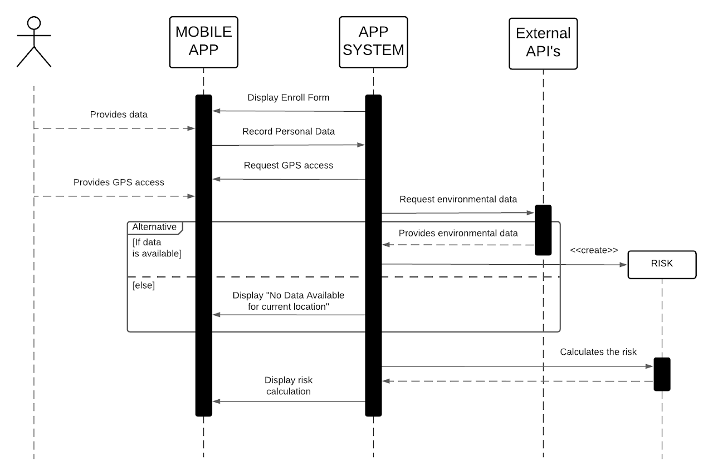
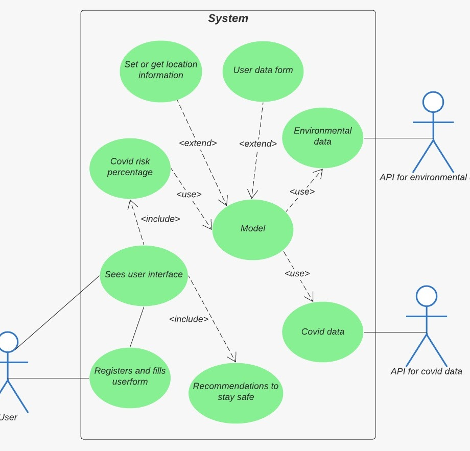

# COVID TRACKER

### By: Eating the frog

## Sumary
Endpoint to retrieve the risk of getting COVID19 using a novel model
The model can be found in [model](https://github.com/morphisjustfun/NASA_CHALLENGE_UTILS)

## Resources
- Flask
- Python3

## Insights
- Good development practices using blueprints and packages
- Use of JSON format to send and retrieve data

## Utils




## To install libraries and run project

Make sure you have python3, pip and virtual env support

```console
foo@bar:~$ python3 -m venv env
foo@bar:~$ source env/bin/activate
foo@bar:~$ pip3 install -r requirements
foo@bar:~$ export FLASK_APP=app
foo@bar:~$ export FLASK_ENV=development
foo@bar:~$ flask run
```

